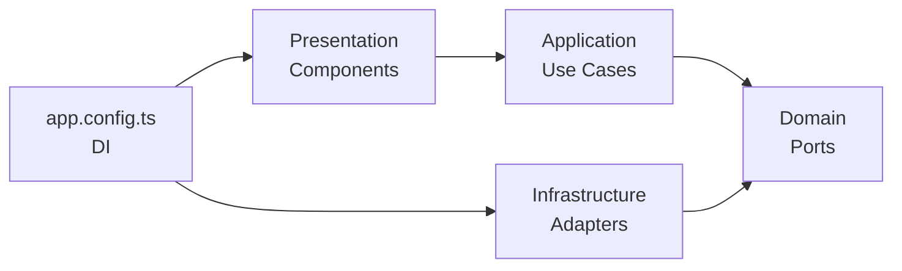

# 🏗️ Arquitectura Hexagonal en API Generator UI

## 📋 Índice
- [¿Qué es Arquitectura Hexagonal?](#qué-es-arquitectura-hexagonal)
- [Estructura del Proyecto](#estructura-del-proyecto)
- [Capas de la Arquitectura](#capas-de-la-arquitectura)
- [Flujo de Dependencias](#flujo-de-dependencias)
- [Ejemplos de Uso](#ejemplos-de-uso)
- [Beneficios](#beneficios)

## ¿Qué es Arquitectura Hexagonal?

La **Arquitectura Hexagonal** (también conocida como **Ports and Adapters**) es un patrón arquitectónico que separa la lógica de negocio del código de infraestructura. 

### Principios Fundamentales:
1. **Domain-Centric**: El dominio (lógica de negocio) es el núcleo
2. **Dependency Inversion**: Las dependencias apuntan hacia el dominio
3. **Technology Agnostic**: El dominio no conoce frameworks ni librerías
4. **Testability**: Fácil de testear cada capa de forma aislada

---

## Estructura del Proyecto

```
src/app/
├── domain/                    # 🎯 Núcleo: Lógica de negocio pura
│   ├── models/               # Entidades del dominio
│   │   ├── collection.model.ts
│   │   ├── document.model.ts
│   │   └── user.model.ts
│   └── ports/                # Interfaces (contratos)
│       ├── collection-repository.port.ts
│       ├── document-repository.port.ts
│       ├── auth-repository.port.ts
│       └── storage.port.ts
│
├── application/              # 📦 Casos de Uso
│   └── use-cases/           # Lógica de aplicación
│       ├── get-collections.use-case.ts
│       ├── create-collection.use-case.ts
│       ├── delete-collection.use-case.ts
│       ├── get-documents.use-case.ts
│       ├── create-document.use-case.ts
│       ├── delete-document.use-case.ts
│       ├── login.use-case.ts
│       ├── register.use-case.ts
│       ├── refresh-token.use-case.ts
│       └── logout.use-case.ts
│
├── infrastructure/           # 🔌 Implementaciones concretas
│   └── adapters/            # Adapters para puertos
│       ├── http-collection.adapter.ts
│       ├── http-document.adapter.ts
│       ├── http-auth.adapter.ts
│       └── local-storage.adapter.ts
│
└── presentation/             # 🎨 Componentes UI (Angular)
    ├── collections/
    ├── documents/
    ├── login/
    └── ...
```

---

## Capas de la Arquitectura

### 1️⃣ **Domain (Dominio)**

Contiene la **lógica de negocio pura**, sin dependencias externas.

#### **Models** (Entidades)
Clases TypeScript puras que representan conceptos del negocio:

```typescript
// domain/models/collection.model.ts
export class Collection {
  constructor(
    public readonly collectionName: string,
    public readonly documentCount: number,
    public readonly createdAt: Date,
    public readonly schema: Record<string, any>
  ) {}

  static fromResponse(data: any): Collection {
    return new Collection(
      data.collectionName,
      data.documentCount,
      new Date(data.createdAt),
      data.schema
    );
  }
}
```

**Características:**
- ✅ Sin `@Injectable()` ni decoradores de Angular
- ✅ Sin `HttpClient` ni dependencias de frameworks
- ✅ Solo lógica de dominio
- ✅ Factory methods para crear instancias

#### **Ports** (Interfaces)
Contratos que definen **qué** puede hacer el sistema (sin especificar **cómo**):

```typescript
// domain/ports/collection-repository.port.ts
export interface ICollectionRepository {
  getAll(): Observable<Collection[]>;
  getById(name: string): Observable<Collection>;
  create(name: string, schema: Record<string, any>): Observable<Collection>;
  delete(name: string): Observable<void>;
}

export const COLLECTION_REPOSITORY = 'COLLECTION_REPOSITORY';
```

**Características:**
- ✅ Solo firmas de métodos (contratos)
- ✅ No hay implementación
- ✅ Define qué datos entran y salen
- ✅ Token para inyección de dependencias

---

### 2️⃣ **Application (Aplicación)**

Contiene los **Casos de Uso** (Use Cases): orquestación de la lógica de negocio.

#### **Use Cases**
Encapsulan operaciones específicas del negocio:

```typescript
// application/use-cases/create-collection.use-case.ts
export class CreateCollectionUseCase {
  constructor(private repository: ICollectionRepository) {}

  execute(name: string, schema: Record<string, any>): Observable<Collection> {
    // ✅ Validaciones de negocio
    if (!name || name.trim() === '') {
      throw new Error('El nombre de la colección es requerido');
    }

    if (!schema || Object.keys(schema).length === 0) {
      throw new Error('El esquema de la colección es requerido');
    }

    // ✅ Delegación al repositorio
    return this.repository.create(name, schema);
  }
}
```

**Características:**
- ✅ Orquesta operaciones del dominio
- ✅ Contiene validaciones de negocio
- ✅ No conoce detalles de implementación (HTTP, localStorage, etc.)
- ✅ Fácil de testear con mocks

---

### 3️⃣ **Infrastructure (Infraestructura)**

Implementaciones **concretas** de los puertos (adapters).

#### **Adapters**
Conectan el dominio con tecnologías específicas (HTTP, localStorage, etc.):

```typescript
// infrastructure/adapters/http-collection.adapter.ts
@Injectable()
export class HttpCollectionAdapter implements ICollectionRepository {
  private apiUrl = 'http://localhost:8080/api/collections';

  constructor(private http: HttpClient) {}

  getAll(): Observable<Collection[]> {
    return this.http.get<any[]>(this.apiUrl).pipe(
      map(collections => collections.map(c => Collection.fromResponse(c)))
    );
  }

  create(name: string, schema: Record<string, any>): Observable<Collection> {
    return this.http.post<any>(this.apiUrl, { collectionName: name, schema }).pipe(
      map(collection => Collection.fromResponse(collection))
    );
  }

  // ...otros métodos
}
```

**Características:**
- ✅ Implementa interfaces del dominio
- ✅ Usa tecnologías específicas (HttpClient, localStorage)
- ✅ Transforma datos externos a modelos del dominio
- ✅ Decorador `@Injectable()` para Angular

---

### 4️⃣ **Presentation (Presentación)**

Componentes de **Angular** que interactúan con los casos de uso.

```typescript
// collections/collections.component.ts
export class CollectionsComponent implements OnInit {
  private getCollectionsUseCase: GetCollectionsUseCase;
  private deleteCollectionUseCase: DeleteCollectionUseCase;

  constructor(
    @Inject(COLLECTION_REPOSITORY) private repository: ICollectionRepository,
    @Inject(AUTH_REPOSITORY) private authRepository: IAuthRepository,
    @Inject(STORAGE_PORT) private storage: IStoragePort
  ) {
    // ✅ Instanciar casos de uso
    this.getCollectionsUseCase = new GetCollectionsUseCase(this.repository);
    this.deleteCollectionUseCase = new DeleteCollectionUseCase(this.repository);
  }

  loadCollections() {
    // ✅ Usar caso de uso
    this.getCollectionsUseCase.execute().subscribe({
      next: (collections) => this.collections = collections,
      error: (err) => this.error = 'Failed to load collections.'
    });
  }
}
```

**Características:**
- ✅ Inyecta **puertos** (interfaces), no implementaciones directas
- ✅ Instancia casos de uso en el constructor
- ✅ No conoce detalles de HTTP ni localStorage
- ✅ Solo se preocupa de la UI

---

## Flujo de Dependencias



### Explicación:
1. **Presentation** depende de **Application** (usa casos de uso)
2. **Application** depende de **Domain** (usa puertos/interfaces)
3. **Infrastructure** implementa **Domain** (adapters implementan puertos)
4. **DI** (app.config.ts) conecta todo

**❌ NO hay dependencias de:**
- Domain → Infrastructure
- Domain → Presentation
- Application → Infrastructure

---

## Inyección de Dependencias

En `app.config.ts` configuramos el binding de puertos a implementaciones:

```typescript
// app.config.ts
import { InjectionToken } from '@angular/core';

// ✅ Crear tokens
export const COLLECTION_REPOSITORY = new InjectionToken<ICollectionRepository>('COLLECTION_REPOSITORY');
export const AUTH_REPOSITORY = new InjectionToken<IAuthRepository>('AUTH_REPOSITORY');
export const STORAGE_PORT = new InjectionToken<IStoragePort>('STORAGE_PORT');

export const appConfig: ApplicationConfig = {
  providers: [
    // ...otros providers

    // ✅ Binding: Puerto → Implementación
    { provide: COLLECTION_REPOSITORY, useClass: HttpCollectionAdapter },
    { provide: AUTH_REPOSITORY, useClass: HttpAuthAdapter },
    { provide: STORAGE_PORT, useClass: LocalStorageAdapter },
  ]
};
```

### ¿Por qué InjectionToken?

Para **cambiar implementaciones sin modificar código**:

```typescript
// En desarrollo: usar localStorage
{ provide: STORAGE_PORT, useClass: LocalStorageAdapter }

// En producción: usar sessionStorage
{ provide: STORAGE_PORT, useClass: SessionStorageAdapter }

// En tests: usar mock
{ provide: STORAGE_PORT, useClass: MockStorageAdapter }
```

---

## Ejemplos de Uso

### Ejemplo 1: Login Component

```typescript
export class LoginComponent {
  private loginUseCase: LoginUseCase;

  constructor(
    @Inject(AUTH_REPOSITORY) private authRepository: IAuthRepository,
    @Inject(STORAGE_PORT) private storage: IStoragePort
  ) {
    this.loginUseCase = new LoginUseCase(this.authRepository, this.storage);
  }

  onSubmit() {
    const { username, password } = this.loginForm.value;

    this.loginUseCase.execute(username, password).subscribe({
      next: (user) => {
        console.log('✅ Login successful:', user.username);
        this.router.navigate(['/collections']);
      },
      error: (err) => {
        this.loginError = err.message;
      }
    });
  }
}
```

### Ejemplo 2: Collections Component

```typescript
export class CollectionsComponent {
  private getCollectionsUseCase: GetCollectionsUseCase;
  private deleteCollectionUseCase: DeleteCollectionUseCase;

  constructor(
    @Inject(COLLECTION_REPOSITORY) private repository: ICollectionRepository
  ) {
    this.getCollectionsUseCase = new GetCollectionsUseCase(this.repository);
    this.deleteCollectionUseCase = new DeleteCollectionUseCase(this.repository);
  }

  loadCollections() {
    this.getCollectionsUseCase.execute().subscribe({
      next: (collections) => this.collections = collections
    });
  }

  deleteCollection(name: string) {
    this.deleteCollectionUseCase.execute(name).subscribe({
      next: () => this.loadCollections()
    });
  }
}
```

---

## Beneficios

### 1. **Testabilidad** 🧪
Puedes testear cada capa de forma aislada:

```typescript
// Test de LoginUseCase
describe('LoginUseCase', () => {
  it('should throw error if username is empty', () => {
    const mockRepo = {} as IAuthRepository;
    const mockStorage = {} as IStoragePort;
    const useCase = new LoginUseCase(mockRepo, mockStorage);

    expect(() => useCase.execute('', 'password'))
      .toThrow('El nombre de usuario es requerido');
  });
});
```

### 2. **Mantenibilidad** 🔧
Cambios en infraestructura no afectan la lógica de negocio:

- Cambiar de HTTP a WebSockets → Solo modificas el adapter
- Cambiar de localStorage a IndexedDB → Solo modificas el adapter
- La lógica de negocio **NO cambia**

### 3. **Escalabilidad** 📈
Fácil agregar nuevas funcionalidades:

1. Crear modelo en `domain/models/`
2. Crear puerto en `domain/ports/`
3. Crear caso de uso en `application/use-cases/`
4. Crear adapter en `infrastructure/adapters/`
5. Registrar en `app.config.ts`
6. Usar en componentes

### 4. **Independencia de Frameworks** 🆓
El dominio no depende de Angular:

- Podrías migrar a React/Vue sin cambiar el dominio
- Podrías usar en Node.js/Backend
- Reutilizable en múltiples proyectos

### 5. **Separación de Responsabilidades** 📦
Cada capa tiene un propósito claro:

| Capa | Responsabilidad |
|------|----------------|
| **Domain** | Lógica de negocio, reglas del dominio |
| **Application** | Orquestación, validaciones |
| **Infrastructure** | Detalles técnicos (HTTP, DB, etc.) |
| **Presentation** | UI, interacción con usuario |

---

## Comparación: Antes vs Después

### ❌ Antes (Arquitectura Tradicional)

```typescript
// Component directamente usa servicio con HttpClient
export class CollectionsComponent {
  constructor(private collectionService: CollectionService) {}

  loadCollections() {
    // Componente acoplado a implementación HTTP
    this.collectionService.listCollections().subscribe(...)
  }
}

// Servicio con lógica mezclada
@Injectable()
export class CollectionService {
  constructor(private http: HttpClient) {}

  listCollections() {
    // HTTP + lógica de negocio mezclada
    return this.http.get('http://localhost:8080/api/collections');
  }
}
```

**Problemas:**
- ❌ Componente acoplado a HTTP
- ❌ Difícil de testear
- ❌ Lógica de negocio mezclada con infraestructura
- ❌ Cambiar implementación requiere modificar múltiples archivos

### ✅ Después (Arquitectura Hexagonal)

```typescript
// Component usa caso de uso (abstracción)
export class CollectionsComponent {
  private useCase: GetCollectionsUseCase;

  constructor(@Inject(COLLECTION_REPOSITORY) repo: ICollectionRepository) {
    this.useCase = new GetCollectionsUseCase(repo);
  }

  loadCollections() {
    // Componente desacoplado de infraestructura
    this.useCase.execute().subscribe(...)
  }
}

// Caso de Uso con lógica de negocio
export class GetCollectionsUseCase {
  constructor(private repository: ICollectionRepository) {}

  execute(): Observable<Collection[]> {
    // Lógica de negocio pura
    return this.repository.getAll();
  }
}

// Adapter con detalles HTTP
@Injectable()
export class HttpCollectionAdapter implements ICollectionRepository {
  constructor(private http: HttpClient) {}

  getAll(): Observable<Collection[]> {
    // Solo detalles de infraestructura
    return this.http.get<any[]>('...').pipe(
      map(data => data.map(d => Collection.fromResponse(d)))
    );
  }
}
```

**Beneficios:**
- ✅ Componente solo conoce el caso de uso
- ✅ Fácil de testear con mocks
- ✅ Lógica de negocio separada
- ✅ Cambiar implementación = solo modificar adapter

---

## 🚀 Próximos Pasos

1. **Migrar todos los componentes** a usar casos de uso
2. **Crear más casos de uso** para operaciones complejas
3. **Agregar unit tests** para cada capa
4. **Implementar adapters alternativos** (ej: MockAdapter para tests)
5. **Documentar casos de uso** con ejemplos

---

## 📚 Referencias

- [Hexagonal Architecture (Alistair Cockburn)](https://alistair.cockburn.us/hexagonal-architecture/)
- [Clean Architecture (Robert C. Martin)](https://blog.cleancoder.com/uncle-bob/2012/08/13/the-clean-architecture.html)
- [Ports and Adapters Pattern](https://herbertograca.com/2017/09/14/ports-adapters-architecture/)

---

**¡Tu aplicación ahora tiene una arquitectura sólida, mantenible y escalable! 🎉**
